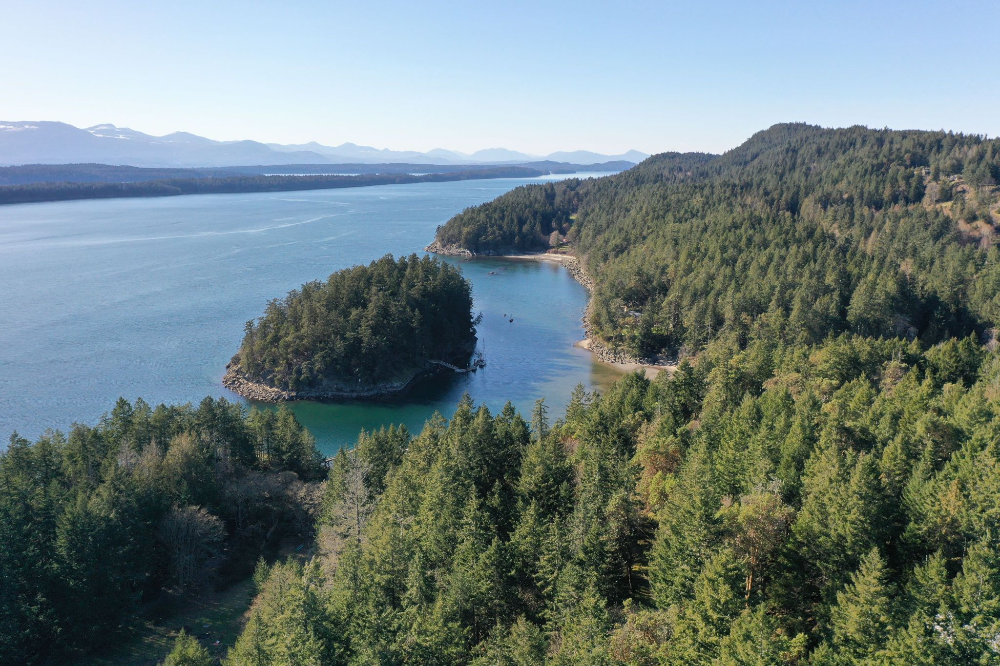
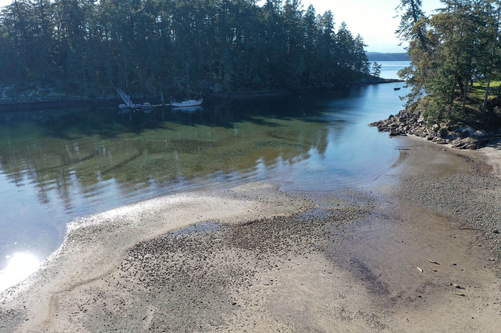
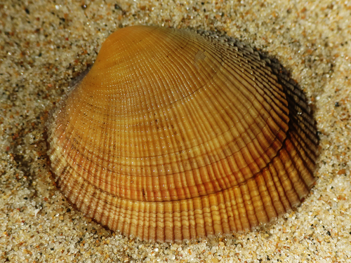
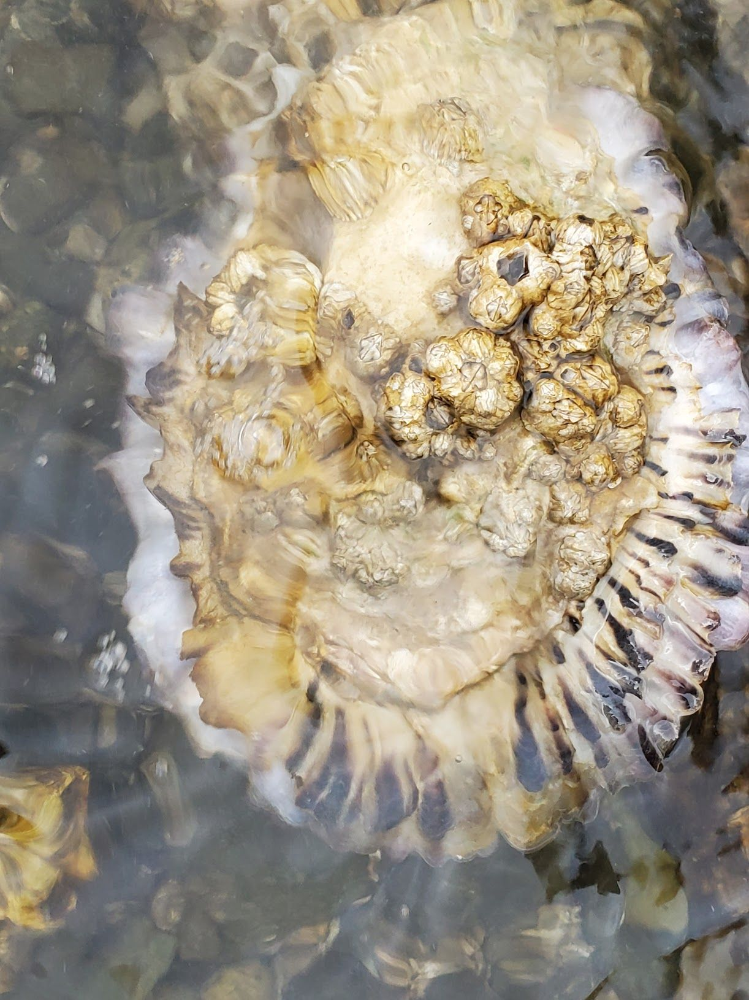
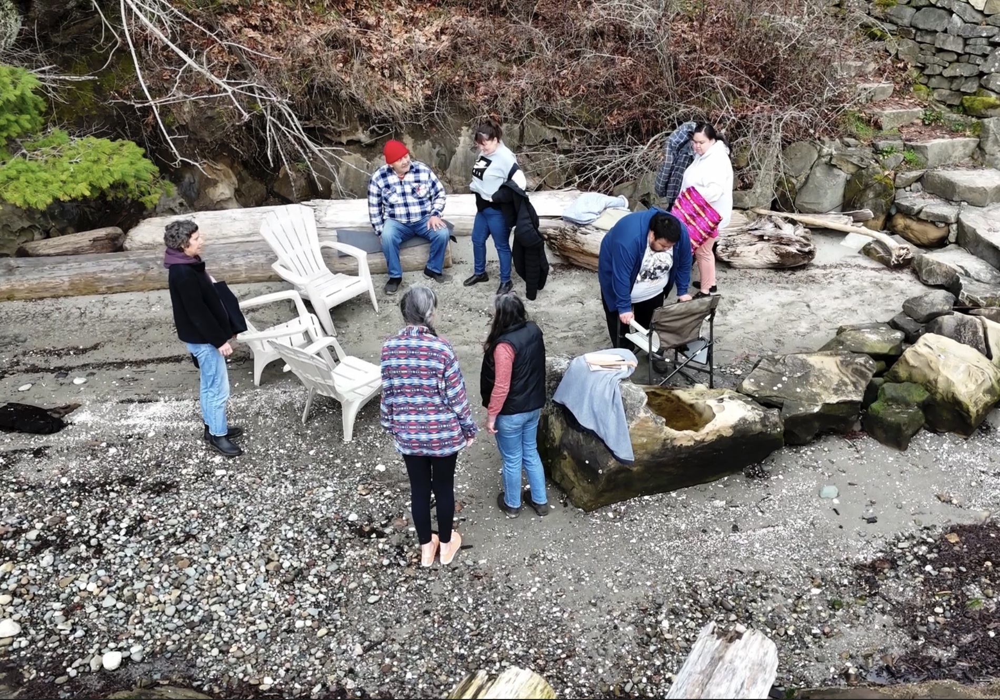
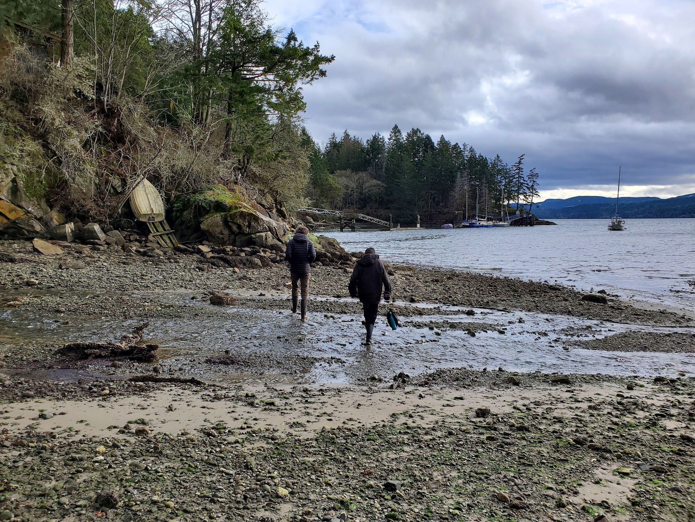

```{r, echo=FALSE, message=FALSE, warning=FALSE}
source("scripts/load_project_vectors.R")
source("scripts/mapbox_map_common.R")
library(dplyr)
```

## Welcome

```{r, echo=FALSE, message=FALSE}
highlightedLayers <- c()
context_bbox <- mx_read("spatial_data/vectors/Context") %>% st_bbox();
introMap <- plot_mapbox_map("Welcome", context_bbox, allSources, communityStyling, highlightedLayers)
introMap

allTaxa <- read.csv("tabular_data/reintegrated-final-taxa.csv")
Taxa <- allTaxa %>% filter(rank %in% c("species", "subspecies", "variety"))
culturalTaxa <- Taxa[!(is.na(Taxa$hulquminumName) | Taxa$hulquminumName==""), ]

```

<p>Tth'ihwum m'i 'ewu i' Xetthecum sii’em.<span>&#8212;</span>Welcome to Xetthecum, a culturally significant place in the heart of the Salish Sea, on Galiano Island, BC. Known as Retreat Cove in English, this is a place endeared to many. Elders and community members have shared their stories of these cherished lands and waters. Others have helped to document the many species that make their home here. So far, community members have documented over a thousand species at Xetthecum, including `r nrow(culturalTaxa)` culturally significant species. Our aim with this story map is to engage you in learning about the rich biodiversity and cultural values of this special place, so that you can contribute to restoring and protecting it.</p>

<div class="data-pane">

<p>Bird's eye view of Xetthecum.</p>
</div>

## The Caves at Xetthecum

```{r, echo=FALSE, message=FALSE}
highlightedLayers <- c()
caves_bbox <- mx_read("spatial_data/vectors/Caves") %>% st_bbox();
introMap <- plot_mapbox_map("Caves", caves_bbox, allSources, communityStyling, highlightedLayers)
introMap
```

<p>Many people know about the sandstone "caves" at Xetthecum<span>&#8212;</span>beautiful tafoni formations that attract people in large numbers throughout the year. However, few are aware that this area holds great cultural significance to Puneluxutth’ and other Hul'q'umi'num'-speaking peoples, and that these caves are of particular spiritual importance. Over the last decade, the caves have become an increasingly popular tourist destination, and are consequently becoming degraded by vandalism and overuse. Concerned community members hope that the caves might some day be protected. Until then, this sacred site remains at serious risk of being irreversibly damaged.</p>

<div class="data-pane">

<p>Caves at Xetthecum.<span>&#8212;</span>Art by Josha Petronis-Akins and Cody Clayton.</p>
</div>

## Respect and Protect

```{r, echo=FALSE, message=FALSE}
highlightedLayers <- c()
caves_bbox <- mx_read("spatial_data/vectors/Caves") %>% st_bbox();
introMap <- plot_mapbox_map("Respect", caves_bbox, allSources, communityStyling, highlightedLayers)
introMap
```

<blockquote>Puneluxutth’ elder Thiyuas (Florence James) expressed her hope that the caves at Xetthecum might be protected.</blockquote>  
<p>Puneluxutth’ elders hold a deep and ancient knowledge about the plants, animals, places and ceremonies of their people, and have emphasized the need to protect important cultural places such as Xetthecum. We encourage you to enjoy the beauty and serenity of this place, while respecting the need to protect it from overuse and damage. Please respect all signage, do not trespass, and know that with these actions you are participating in the important work of reconciliation. Thank you. Huy'ch'qa!</p>

<div class="data-pane">
<div class="iframe-container">
<iframe src="https://www.youtube.com/embed/XWTrRw38PuQ?si=bZnG3F_flXePUCab" title="YouTube video player" frameborder="0" allow="accelerometer; autoplay; clipboard-write; encrypted-media; gyroscope; picture-in-picture; web-share" allowfullscreen></iframe>
</div>
<p>Listen to the Caves:</p>
<audio controls src="audio/cavesRecording.mp3" loop="true" title="Listen to the Caves"></audio>
</div>

## Land Acknowledgement

```{r, echo=FALSE, message=FALSE}
highlightedLayers <- c("HulqTreaty")
context_bbox <- mx_read("spatial_data/vectors/HulqTreaty") %>% st_bbox() %>% expand_bbox(0.2);
acknowledgmentMap <- plot_mapbox_map("Acknowledgment", context_bbox, allSources, hulqStyling, highlightedLayers)
acknowledgmentMap
```

<p>In the spirit of respect and gratitude, we acknowledge that Xetthecum (Retreat Cove), Galiano Island lies within the transboundary region of the Salish Sea, a diverse bioregion that has been tended to and cherished by Coast Salish peoples since time immemorial. Galiano Island is held within the shared, asserted, and unceded traditional territories of the Puneluxutth’, Lamalcha, and Hwlitsum First Nations, as well as the shared, asserted, and ceded traditional territories of Tsawwassen First Nation. We also acknowledge the territories of all other Hul'q'umi'num'-speaking peoples who hold rights and responsibilities in this region.</p>

<p>This project is a work in progress and we are learning and fumbling together as we go. Please be in touch with us with any thoughts, questions or ideas regarding what you see here.</p>

<div class="data-pane">

<p>Xetthecum (Retreat Cove) lies in the territories of the Hul'q'umi'num' Treaty Group.</p>
</div>

## Xetthecum

```{r, echo=FALSE, message=FALSE}
highlightedLayers <- c()
XetthecumMap <- plot_mapbox_map("Xetthecum", project_bbox, allSources, communityStyling, highlightedLayers)
XetthecumMap
```

<p>The name 'Xetthecum' is used by Hul'q'umi'num'-speakers to refer specifically to Retreat Cove. Yet in the landscape context, where everything is connected, its boundaries might be expanded to include the greater extent of the Greig Creek Watershed, including the creek which runs from Laughlin Lake to the cove. Indeed, stories told of Xetthecum always connect with the biodiversity present throughout the watershed. Today, this watershed spans residential and agricultural lands, protected and covenanted areas, as well as a public shore access and dock. Complex in its ecology, cultural history, and contemporary land-use, this coastal landscape is a vibrant mosaic that includes many intersecting ways of life, weaving together both human and more-than-human worlds.</p> 

<div class="data-pane">
<p>From here, we welcome you to use the map legend to explore the cultural significance of Xetthecum's ecological communities, or continue along the lines of this story map's main narrative.</p>
<div class="imerss-map-legend">
</div>
</div>

## Cultural Activities Part I

```{r, echo=FALSE, message=FALSE}
highlightedLayers <- c()
XetthecumMap <- plot_mapbox_map("Cultural_Activities_pI", project_bbox, allSources, communityStyling, highlightedLayers)
XetthecumMap
```

<blockquote>“We must protect the food sources. There are a lot of foods and medicines that are no longer there anymore.”<span>&#8212;</span>Puneluxutth’ elder Thiyuas (Florence James)</blockquote>

<p>Puneluxutth’ elder Thiyuas (Florence James) and her family once gathered a rich array of resources at Xetthecum, traveling from Retreat Cove to Laughlin Lake and back, collecting berries, fruit, shellfish, and other resources along the way. This story map begins with the rich abundance of marine life found at the cove, before following in the footsteps of Thiyuas (Florence James) and her family up Greig Creek to Laughlin Lake.</p> 

<div class="data-pane">

<p>Xetthecum (Retreat Cove), Galiano Island, BC, Canada.</p>
</div>

## Cultural Activities Part II

```{r, echo=FALSE, message=FALSE}
highlightedLayers <- c()
XetthecumMap <- plot_mapbox_map("Cultural_Activities_pII", project_bbox, allSources, communityStyling, highlightedLayers)
XetthecumMap
```

<p>Beyond its importance for resource gathering, fishing and hunting, Xetthecum was also a place of sacred ceremonial importance. Puneluxutth’ elders hold sacred and spiritual knowledge regarding certain plants, animals, places and ceremonies of their people, much of which has not been included on this website. This knowledge will be passed down only to those with the rights and training to be able to receive it and use it safely and appropriately.</p>

<div class="data-pane">
<p>Important cultural activities at Xetthecum include:</p>

<div class="cultural-activities">
 <div class="cultural-activities-row">
  <b>Fishing, Hunting and Shellfish Harvesting</b>
 </div>
 <div class="cultural-activities-row">
  <b>Gathering Berries and Natural Resources</b>
 </div>
 <div class="cultural-activities-row">
  <b>Gathering Medicine</b>
 </div>
 <div class="cultural-activities-row">
 <b>Social, Ceremonial and Spiritual Activities</b>
 </div>
</div>
</div>

## Retreat Cove Part I

```{r, echo=FALSE, message=FALSE}
highlightedLayers <- c()
cove_bbox <- mx_read("spatial_data/vectors/Cove") %>% st_bbox();
CoveMap <- plot_mapbox_map("Cove_pI", cove_bbox, allSources, communityStyling, highlightedLayers)
CoveMap
```

<p>For those arriving at Xetthecum by boat or canoe, the cove is of foremost importance as a place of refuge, where one can find calmer waters to rest or to retreat during a storm. Training for canoe races, Puneluxutth’ elder Augie Sylvester recalled days canoeing from the North End reserve down to Retreat Cove, around Retreat Island, and all the way back home. The cove and surrounding offshore waters also provide habitat for a great diversity of fishes such as [the'wun](#taxon:Oncorhynchus kisutch) (coho), which made this place an important fishing site. Today, however, Retreat Cove lies within a marine protected area, to protect endangered [t'q'as](#taxon:Sebastes) (rockfish) from over-fishing.</p>

<div class="data-pane">
<p>Those with a deep connection to Xetthecum share a common experience in relation to the rich biodiversity of this place:</p>
<blockquote>“I used to spend time up in Xetthecum with my grandparents visiting with friends and picking berries and fruit. Sometimes we would anchor in there if we had to when we were on the boats.”<span>&#8212;</span>Rosemary Georgeson</blockquote>
<blockquote> "Xetthecum was important for social and cultural gatherings, as well as for traditional activities such as fishing and clam digging."<span>&#8212;</span>Lorne Silvey</blockquote>
<blockquote> Landing at Retreat Cove with her family, Thiyuas recalled that stsa'kwum (surf smelts) would go by and move in circles, while the seagulls swooped and dived trying to get them.</blockquote>
<blockquote>Fred Wilson recounted that Xetthecum was a place he used to go to hunt and to fish for lingcod.</blockquote>
</div>

## Retreat Cove Part II

```{r, echo=FALSE, message=FALSE}
highlightedLayers <- c()
cove_bbox <- mx_read("spatial_data/vectors/Cove") %>% st_bbox();
CoveMap <- plot_mapbox_map("Cove_pII", cove_bbox, allSources, communityStyling, highlightedLayers)
CoveMap
```

<p>Beyond a place of refuge and fish, Retreat Cove opens up on an important source of freshwater, as well as opportunities for hunting and travel. Lying at the narrowest point on the island, a shore-to-shore footpath connected Retreat Cove with Cable Bay, allowing over-land travel across the island. Augie recalled landing at Xetthecum and walking across the island to Pebble Beach, to hunt for [ha’put](#taxon:Odocoileus hemionus columbianus) (deer). Like other Indigenous community members, Augie has fond memories of harvesting shellfish at Xetthecum. After hunting or harvesting, he remembered that he would sometimes row across the Trincomali Channel to Fernwood to trade meat, fish, or shellfish for vegetables with the Sampson family.</p>

<div class="data-pane">

<p>View across the Trincomali Channel to Fernwood on Salt Spring Island.</p>
</div>

## Greig Creek Delta Part I

```{r, echo=FALSE, message=FALSE}
highlightedLayers <- c("Delta");
delta_bbox <- mx_read("spatial_data/vectors/Delta") %>% st_bbox();
deltaMap <- plot_mapbox_map("Delta_pI", delta_bbox, allSources, communityStyling, highlightedLayers)
deltaMap
```


<p>Greig Creek delta</p>

<p>The Greig Creek delta was once home to clam gardens, which were cultivated as an important food source for the Puneluxutth’. Clam digging, thus, has long been an important cultural activity at Xetthecum. [Skw'lhey](#taxon:Leukoma staminea) (littleneck clams) were harvested from the delta during the spring and summer night tides. Other marine life such as [s-axwa'](#taxon:Saxidomus gigantea) (butter clams) and [stl'ula'um](#taxon:Clinocardium nuttallii) (basket cockles) were also gathered at Xetthecum. The shellfish were laid over top of [q'am'](#taxon:Nereocystis luetkeana) (bull kelp) and then stepped on to get the water out. Ironwood, or [qethulhp](#taxon:Holodiscus discolor) (oceanspray), was singed in the fire, used to poke the clams, and then stuck in the mud by the fire to cook them. [Xpey'](#taxon:Thuja plicata) (western red cedar) bark was made into rope which was used to string up clams by the fire. After they were cooked, the shellfish was smoked. [Xelex uwe](#taxon:Enteroctopus dofleini) (giant Pacific octopus) was speared, usually at night.</p>

<div class="data-pane">

<p>Littleneck clams ([skw'lhey](#taxon:Leukoma staminea))</p>
</div>

## Greig Creek Delta Part II

```{r, echo=FALSE, message=FALSE}
highlightedLayers <- c("Delta");
delta_bbox <- mx_read("spatial_data/vectors/Delta") %>% st_bbox();
deltaMap <- plot_mapbox_map("Delta_pII", delta_bbox, allSources, communityStyling, highlightedLayers)
deltaMap
```


<p>A large bed of Pacific oysters is now established at the Greig Creek delta.</p>

<p>The delta at Xetthecum has changed dramatically since the days of stories recounted by Thiyuas. Once rich with a great variety of shellfish, today the area is dominated by the introduced [tl'uxwtl'uxw](#taxon:Magallana gigas) (Pacific oyster), which Thiyuas did not recall observing when she visited this place with her family in the past.</p>

<div class="data-pane">

<p>[tl'uxwtl'uxw](#taxon:Magallana gigas) (Pacific oyster).</p>
</div>

## Eelgrass Beds Part I

```{r, echo=FALSE, message=FALSE}
highlightedLayers <- c("EelgrassSimplified");
eelgrass_bbox <- mx_read("spatial_data/vectors/EelgrassSimplified") %>% st_bbox();
eelgrassMap <- plot_mapbox_map("Eelgrass_pI", eelgrass_bbox, allSources, communityStyling, highlightedLayers)
eelgrassMap
```

<p>Lying between the mouths of Greig Creek (Hwta’loonèts) and Davidson Creek, the eelgrass beds at Xetthecum are an important marine ecological community. [Eelgrass](#taxon:Zostera marina) is a foundation species that creates a complex marine habitat, providing shelter for a large number of species<span>&#8212;</span>from microscopic bacteria and algae to crabs, fishes and birds at higher trophic levels. The eelgrass beds at Xetthecum form a saltwater (kw’atl’kwa) nursery home to juvenile salmon and lhumuq'e' (sole), as well as spawning ground for [slhewut'](#taxon:Clupea pallasii) (Pacific herring). They also provide foraging habitat for small invertebrates and many larger creatures, including [smuq’wa](#taxon:Ardea herodias fannini) (great blue heron), [ey'x](#taxon:Metacarcinus magister) (dungeness crab), and [exu](#taxon:Branta canadensis) (Canada goose).</p>

<div class="data-pane">

<p>[T'q'as](#taxon:Sebastes) (copper rockfish) swimming in a bed of [chəәləәm (eelgrass)](#taxon:Zostera marina)</p>
<p>Eelgrass meadows, bull kelp beds, and coastal marshes are important carbon sinks, absorbing carbon dioxide at a rate of up to 90 times that of forests on land. Protection and conservation of these areas is thus important not only for biodiversity and marine species health, but also for global climate change mitigation.</p>
</div>

## Eelgrass Beds Part II

```{r, echo=FALSE, message=FALSE}
highlightedLayers <- c("EelgrassSimplified");
eelgrass_bbox <- mx_read("spatial_data/vectors/EelgrassSimplified") %>% st_bbox();
eelgrassMap <- plot_mapbox_map("Eelgrass_pII", eelgrass_bbox, allSources, communityStyling, highlightedLayers)
eelgrassMap
```

<b>‘Imush Q’uyatl’un</b>
<p>The eelgrass meadow at Xetthecum is home to [q’uyatl’un](#taxon:Melibe leonina) (hooded nudibranch). The short film *I’mush q’uyatl’un*, follows the movements of this sea slug as it dances through the water during a receding tide. In the film, q’uyatl’un dances to a Puneluxutth’ song titled, *Imush ‘Q’uyatl’un* (“Be with me Seaslug”), sung by Thiyuas (Florence James). The short film is accompanied by text composed by Karolle Wall. It is a simple story, explaining the importance of moving slowly, paying attention, and observing every little aspect of the environment.</p>

<div class="data-pane">
<div class="iframe-container">
<iframe src="https://player.vimeo.com/video/32713022?h=659ac9c205" frameborder="0" allow="autoplay; fullscreen; picture-in-picture" allowfullscreen></iframe>
</div>
<p><a href="https://vimeo.com/32713022">&#039;Imush Q&#039;uyatl&#039;un</a> from <a href="https://vimeo.com/user5078648">Karolle Wall</a> on <a href="https://vimeo.com">Vimeo</a>.</p>
</div>

## Hwta’loonèts / Greig Creek

```{r, echo=FALSE, message=FALSE}
highlightedLayers <- c("GreigCreek");
greig_bbox <- mx_read("spatial_data/vectors/GreigCreek") %>% st_bbox();
greigMap <- plot_mapbox_map("Greig", greig_bbox, allSources, communityStyling, highlightedLayers)
greigMap
```

<p>The Hul'q'umi'num' name for Greig Creek is Hwta’loonèts, as shared by Thiyuas. This watercourse runs from Laughlin Lake to Retreat Cove, providing an important freshwater source for seafaring Coast Salish peoples. Historical evidence dating to the late 1980s suggests that the Greig Creek watershed may have once supported a run of [the'wun](#taxon:Oncorhynchus kisutch) (coho), an important source of food for the Puneluxutth’. However, over the last century the watercourse has been severely degraded by intensive agricultural and logging practices. In the mid 1990s, a local educator by the name of Lynne Scott initiated a project, *Salmon in the Classroom*, to release coho and chum salmon fry to Hwta’loonèts with the help of youth at the Galiano Community School. Today, the Galiano Conservancy Association continues these efforts in collaboration with schools throughout the region.</p> 

<div class="data-pane">
<div class="iframe-container">
<iframe src="https://www.youtube.com/embed/AAdwf8mGWyE?si=w6oC687E_8us0x10" title="YouTube video player" frameborder="0" allow="accelerometer; autoplay; clipboard-write; encrypted-media; gyroscope; picture-in-picture; web-share" allowfullscreen></iframe>
</div>
<p>Listen to the Creek:</p>
<audio controls src="audio/greigRecording.mp3" loop="true" title="Listen to the Creek"></audio>
</div>

## Xatsa’ / Laughlin Lake

```{r, echo=FALSE, message=FALSE}
highlightedLayers <- c("LaughlinLake");
laughlin_bbox <- mx_read("spatial_data/vectors/LaughlinLake") %>% st_bbox();
laughlinMap <- plot_mapbox_map("Laughlin", laughlin_bbox, allSources, communityStyling, highlightedLayers)
laughlinMap
```

<p>Thiyuas and her family would gather edible and medicinal plants throughout the Greig Creek watershed, from Retreat Cove to Laughlin Lake. She recalled gathering [kwumsuli'qw](#taxon:Basidiomycota) (mushrooms), as well as [tlu'siip](#taxon:Polypodium glycyrrhiza)) (licorice fern root) from [q'um'-unulhp](#taxon:Acer macrophyllum) (bigleaf maple), near Retreat Cove. [Sqw''iil'muhw](#taxon:Rubus ursinus) (trailing blackberries) were picked at Retreat Cove, and beyond, all the way up to Lighthouse Road. The family would wake at 5 am with granny and walk to collect the berries.</p>

<p>Laughlin Lake was an especially important destination for a selection of wetland plant species. Laughlin Lake is a shallow body of freshwater, forming part of a complex wetland ecosystem that supports a diversity of plant life, including culturally significant species like [stth’e’qun](#taxon:Typha angustifolia) (cattail) and [xáts’et](#taxon:Chamaenerion angustifolium) (fireweed). The base of [stth’e’qun](#taxon:Typha angustifolia) can be eaten like a vegetable, and looks like celery. It was also used for creating mats. [Xáts'et](#taxon:Chamaenerion angustifolium) was used for stuffing sleep mats.</p> 

<p>Thiyuas and her family would sometimes travel to Retreat Cove in the racing canoe. They would pull in near Retreat Island and Thiyuas’ grandfather would walk up to Laughlin Lake for medicine. At other times the whole family would gather traditional medicines at Laughlin Lake, including qwun'ulhp (false hellebore), an important medicine in canoe racing, which is no longer known to occur on Galiano Island.</p> 

<div class="data-pane">
<div class="iframe-container">
<iframe src="https://www.youtube-nocookie.com/embed/v_1NrdnZkY0?si=01FAAbocSIeMBCYi" title="YouTube video player" frameborder="0" allow="accelerometer; autoplay; clipboard-write; encrypted-media; gyroscope; picture-in-picture; web-share" allowfullscreen></iframe>
</div>
<p>While heavily modified, Laughlin Lake still provides critical habitat for species like black-tailed deer ([ha’put](#taxon:Odocoileus hemionus columbianus)) and red-legged frog.</p>
</div>

## Community Connections at Xetthecum

```{r, echo=FALSE, message=FALSE}
highlightedLayers <- c()
cove_bbox <- mx_read("spatial_data/vectors/Cove") %>% st_bbox();
communityConnectionsMap <- plot_mapbox_map("Community_Connections", cove_bbox, allSources, communityStyling, highlightedLayers)
communityConnectionsMap
```

<p>The collaborative efforts of many individuals, groups and organizations have been instrumental to the restoration and protection of Xetthecum. Their contributions, support, and guidance have been essential as we navigated many complexities in learning about the importance of this sacred place.</p> 

<p>We are grateful to the Access to Media Education Society, Capital Regional District, Community Engagement Fellows, Galiano Conservancy Association, Hunterston Farm community, Inclusive Design Research Centre, Indigenous Watersheds Initiative, Islands Trust Council, Southern Gulf Islands Community Resource Centre, MIT Solve Indigenous Communities Fellowship, Northeast Pacific Coastal Biodiversity Action Network, Social Sciences and Humanities Research Council, UBC BRITE Internship Program, and Whiteswan Environmental for making this work possible. We also thank our advisors, contributors, partners, Galiano Island community members, and especially Puneluxutth’ elders Florence James (Thiyuas) and Augie Sylvester for their contributions to this work.<span>&#8212;</span>huy ch q’a sii’em!</p>

<div class="data-pane">

<p>Augie Sylvester and family members gather along with Xetthecum team members to share stories at Retreat Cove.</p>
</div>

## Preservation and Future Vision Part I

```{r, echo=FALSE, message=FALSE}
highlightedLayers <- c()
futureVisionMap <- plot_mapbox_map("Future_Vision_pI", project_bbox, allSources, communityStyling, highlightedLayers)
futureVisionMap
```

<p>Xetthecum is a vital marine sanctuary and protected area crucial for preserving [t’q’as](#taxon:Sebastes) (rockfish) and shellfish populations. Restoration initiatives grounded in Indigenous wisdom and practices will help to safeguard the area’s resources for future generations. Knowledge keepers have encouraged the restoration of clam gardens and preservation of eelgrass at Xetthecum, as well as continuing efforts to restore Greig Creek.</p>

<p>Both Indigenous and non-Indigenous communities are actively involved in preserving and reconnecting with the land through educational initiatives and conservation projects, aiming for a sustainable future vision for Galiano Island. Visit our Resources page for examples of ongoing restoration efforts on Galiano Island.</p>

<p>May our work on this project and presence on this island contribute to a future that recognizes the importance of reconciliation, collaboration, and the rightful place of Indigenous knowledge in shaping the well-being of the Salish Sea and its inhabitants.</p>

<div class="data-pane">

<p>Healing the land heals the people.</p>
</div>

## Preservation and Future Vision Part II

```{r, echo=FALSE, message=FALSE}
highlightedLayers <- c()
futureVisionMap <- plot_mapbox_map("Future_Vision_pII", context_bbox, allSources, communityStyling, highlightedLayers)
futureVisionMap
```

<p>For generations, Xetthecum has been a vital refuge for Indigenous community members from Pune’luxutth and Galiano Island, as well as for travelers seeking shelter from inclement weather. However, the relentless tide of colonization has severed crucial connections to family, culture, language, and place based practices and protocols that once bound Indigenous people to this sacred land. Thiyuas, a respected elder, articulated during our discussions the profound harm of assimilation, emphasizing the loss of language, family ties, and cultural heritage.</p>

<p>Through our endeavours at Xetthecum and in similar locales, we strive to support the reestablishment of the deep connections to place, family, culture, language, and spiritual traditions that have defined the way of life for the Hwulmuhw Mustimuhw (Indigenous People) since time immemorial. As we navigate our learning journey, fumbling at times but steadfast in our commitment, we are reminded of the adage: healing the land heals the people. Our collective pursuit aims to restore biodiversity and traditional land stewardship practices, bolstered by contemporary knowledge, with the overarching goal of achieving food sovereignty through ancestral stewardship and harvesting practices for the Hwulmuhw Mustimuhw (Indigenous People) of Pune’luxutth and Galiano Island. Moreover, our efforts seek to nurture the learning and perpetuation of language, cultural, and spiritual practices, while fostering the continued healing and leadership of Indigenous communities.</p>

<div class="data-pane">

<p>Envisioning a vibrant future for Xetthecum.</p>
</div>

## Ecological Communities - Hwuiumqa' / Marine

<p>Surrounded by water, Galiano Islanders see the ocean as intrinsic to living and loving life on this island. Sightings of [q'ul-lhanamutsum](#taxon:Orcinus orca) (orcas) and other marine mammals are treasured hallmarks of island life. However, for many community members, the ocean is first and foremost a source of food and livelihood. Both Indigenous and non-Indigenous people on Galiano enjoy fish such as thuqi' (sockeye salmon), haan (pink salmon), tuqwtuqw (red snapper) and other [t’q’as](#taxon:Sebastes) (rockfish). Also prized are [s-axwa'](#taxon:Saxidomus gigantea) (butter clam), kwuneem'mun' (scallops), [ey'x](#taxon:Metacarcinus magister) (dungeness crab), [thikwt](#taxon:Apostichopus californicus) (sea cucumber) and seaweeds such as [lhuq'us](#taxon:Pyropia) (red laver). Thiyuas (Florence James) shared that ['e s-hw](#taxon:Phoca vitulina richardii) (harbour seal) is also prized as a dark meat.</p> 

<p>Xetthecum (Retreat Cove) is one of the few marine locations on the shoreline of Galiano itself that has been an important place for fishing and harvesting shellfish. Its importance as a habitat for [t’q’as](#taxon:Sebastes) (rockfish) in particular has since become so notable that it has been designated a marine protected area, where fishing is banned to protect these long-lived species that are so slow to reproduce. As the tide is not too fast, Xetthecum was once also a good area for harvesting other creatures, such as [pun'eq'](#taxon:Panopea generosa) (geoduck) and dog fish. It is important that community members are able to harvest and consume these foods without getting sick, therefore the environmental health of the ocean is vital.</p>

<p>Culturally significant beaches and shorelines on Galiano Island, such as those near Xetthecum are used as places to congregate for picnics, social events, ceremonial sites, and as food gathering sites by local First Nations peoples. Bays, inlets, and coves like Xetthecum are also a place of safe harbour during storms, or places to moor one's boat during winters.</p>

<p>Many, if not all, of the Indigenous families associated with Galiano have been fishing since time out of mind. The Seafood Fest has been an extremely significant annual cultural event for decades primarily because so many of the island’s inhabitants have been passing down the skills, knowledge and secret locations of where to find the best sources of seafood for generations. Unfortunately, due to over-fishing, destruction of marine habitat, pollution and other industrial causes, the bounty of the sea has become so limited that few members of the next generation can make a living fishing, and most of the menu for the Seafood Fest now has to be purchased from elsewhere.</p>

<p>In the past, no one would ever reveal the locations of where to harvest seafood, but now such knowledge is often recounted as memories of now lost or declining biodiversity. Locations of significance include Porlier Pass and Walker Hook off of Saltspring for [t’q’as](#taxon:Sebastes) (rockfish) and Pinnacle Rock on the south side of Porlier Pass for ['eeyt](#taxon:Ophiodon elongatus) (lingcod). As for salmon, Cable Bay was once a good location for kw'a'luhw (chum salmon), as was Enterprise Reef off of Mayne Island and areas around Valdes Island. Yet many fishing areas that have been important for Indigenous community members on Galiano over the past hundred years are much farther away, necessitating long periods of time that families are separated. The closest of these locations include the west coast of Vancouver Island such as Jordan River, Race Rocks, San Juan Harbour near Port Renfrew, and areas near River’s Inlet to the Skeena.</p> 

```{r, echo=FALSE, message=FALSE}
highlightedLayers <- c("Marine")
marineMap <- plot_mapbox_map("Marine", project_bbox, allSources, communityStyling, highlightedLayers)
marineMap
```

## Ecological Communities - Thuthiqut / Forests

<p>Shaped by interactions between water, soil, terrain, climate and the multitudes of beings that live within them, forests are a sanctuary for hundreds of thousands of species of plants, fungi, mammals, birds, insects and microorganisms. Forests provide shelter, clean water, and food, the foundations for a complex web of life in which we are intricately interconnected. Humans have been stewarding forests on Galiano since time out of mind, in order to ensure key species that we depend on can flourish and help us thrive.</p>

<p>Dry ridges or steep southwest facing slopes with nutrient poor, shallow soils tend to be dominated by a mix of gnarled [ts’sey](#taxon:Pseudotsuga menziesii menziesii) (Douglas-fir) and [qaanlhp](#taxon:Arbutus menziesii) (arbutus), and shrubby species such as [lulutth'sulhp](#taxon:Berberis aquifolium) (dull oregon grape) or [xwiinlhp](#taxon:Rosa gymnocarpa) (baldhip rose), all of which valued as medicine. These drier forested communities are mapped as woodlands in this map.</p>

<p>Moister forests are characterized by towering [ts’sey](#taxon:Pseudotsuga menziesii menziesii) (Douglas-fir) and robust [xpey’](#taxon:Thuja plicata) (western red cedar). [Xpey’](#taxon:Thuja plicata) is known as the ‘tree of life’, as it provides essential material for everything from ocean-worthy canoes, to rot-resistant buildings, beautiful carvings, and woven rain hats. Oldgrowth [xpey’](#taxon:Thuja plicata) are most valued for these purposes, and are allowed to grow slowly for hundreds of years to provide fine and clear-grained bark for weaving and wood for carving. Traditional Indigenous harvesting methods of only taking a strip of bark or plank of wood from one side allows such trees to survive, heal and continue growing. The understory in this type of forest is inhabited by plants resistant to the fungicide [xpey’](#taxon:Thuja plicata) releases into the soil to discourage competition from other plants. This type of forest is often thick with [t'eqe'](#taxon:Gaultheria shallon) (salal) and [suniiulhp](#taxon:Berberis nervosa) (dull Oregon grape), both of which provide nutritious berries. [Sthxélem](#taxon:Polystichum munitum) (sword fern) is also common in such forests, and is regarded as a spiritually significant plant.</p> 

<p>These older forests are models of complexity, exhibiting a vast diversity of composition (the parts), structure (the arrangement of the parts), and function (how the parts interact with one another). Moss-covered [ts'alhulhp](#taxon:Acer macrophyllum) (bigleaf maple) offer habitat for other culturally significant species, such as [tl’usiip](#taxon:Polypodium glycyrrhiza) (licorice fern), which Thiyuas and her family used as a sweetener: If one gently lifts the moss with your pinky to reveal the root, the licorice fern root can be rinsed, chopped up, mixed with berries, and placed on a board in the sun to dry.</p>

<p>In mature and old growth forests, trees are present in all stages of their life cycles including standing dead snags and fallen debris, providing critical habitat for culturally significant species such as [yuxwule'](#taxon:Haliaeetus leucocephalus) (bald eagle) and [ha'put](#taxon:Odocoileus hemionus columbianus) (black tailed deer). Forests are valued for hunting [ha'put](#taxon:Odocoileus hemionus columbianus) from September to October, although Thiyuas cautions that one should not hunt females or hunt after the rut, but wait until after the ironwood [(qethulhp)](#taxon:Holodiscus discolor) blooms turned brown. As a ritual, the first deer hunted was always shared; each species had their rules and rituals. It is tradition to bring an elder a piece of meat from hunting, just as one shares the first fish caught during seafood harvests.</p>

```{r, echo=FALSE, message=FALSE}
highlightedLayers <- c("Forests")
forestsMap <- plot_mapbox_map("Forests", project_bbox, allSources, communityStyling, highlightedLayers)
forestsMap
```

## Ecological Communities - Tl'elhumqa' / Freshwater

<p>Healthy wetlands, lakes and streams are havens for humans and wildlife alike, providing critical habitat and a source of freshwater. A diversity of plant life, bacteria and insects thrive in these ecosystems, forming complex food webs that support many culturally important species, such as stseelhtun (salmon). The enhanced growth and forest structure found in riparian areas provides necessary cover for wildlife, which is also important for culturally significant activities such as hunting and birdwatching. Animals such as [ha'put](#taxon:Odocoileus hemionus columbianus) (black tailed deer) and [smuqw'a'](#taxon:Ardea herodias fannini) (great blue heron) depend on freshwater areas for food and water.</p>

<p>Wetlands on Galiano include lakes, shallow water, swamps, marshes, wet meadows, fens, and bog communities, many of which are represented in the watershed that flows into Xetthecum. Swamps and riparian areas include flood-tolerant trees such as [xpey’](#taxon:Thuja plicata) (western red cedar) which “like to have their feet wet”, [kwulala'ulhp](#taxon:Alnus rubra) (red alder), whose inner bark offers a source of emergency food in the spring, and [swele’ulhp](#taxon:Salix lucida) (willow), which is useful for making fish traps. Other helpful plants that grow here include [stth'e'qun](#taxon:Typha angustifolia) (cattail) which provides a useful source of materials for both binding and insulation, [sxum'xum'](#taxon:Equisetum arvense) (horsetail), which makes a yellow brown dye and [ts'a'kw'a'](#taxon:Lysichiton americanus) (skunk cabbage) which can be used to wrap food to keep it fresh. These areas are prized for berry-picking and gathering other edible and medicinal plants such as [lila’](#taxon:Rubus spectabilis) (salmonberry), [t'uqwum'](#taxon:Rubus parviflorus) (thimbleberry), [t'eqe'](#taxon:Gaultheria shallon) (salal), [suniiulhp](#taxon:Berberis aquifolium) (Oregon grape), [sqw'uqwtsus](#taxon:Vaccinium parvifolium) (red huckleberry) and me’uwhulhp (Labrador tea).</p>

<p>Colonial settlers began to alter Galiano’s landscape in the late 1800’s in ways that were very different from the strategies used by pre-contact First Nations communities. Instead of respecting the integrity of streams, wetlands and riparian areas and honouring the role that [sqwul'ew'](#taxon:Castor canadensis) (beaver) play in revitalizing freshwater ecosystems, these areas have been focal points for resource extraction, agriculture, logging, construction, transportation and waste disposal. Greig Creek is one of many watersheds on Galiano Island that have been heavily impacted by these activities.</p> 

```{r, echo=FALSE, message=FALSE}
highlightedLayers <- c("Freshwater")
freshwaterMap <- plot_mapbox_map("Freshwater", project_bbox, allSources, communityStyling, highlightedLayers)
freshwaterMap
```

## Ecological Communities - Shthuliim / Woodlands

<p>Often known as Garry Oak Meadow ecosystems, a decolonized perspective prioritizes not the largest, most visually obvious species, [P'hwulhp](#taxon:Quercus garryana) (Garry oak, named for a Hudson’s Bay Company officer, Nicholas Garry, by botanist David Douglas), but instead the most culturally significant species, [speenhw](#taxon:Camassia leichtlinii) (blue camas). Fields of [speenhw](#taxon:Camassia leichtlinii) have been cultivated for thousands of years by First Nations Camas Keepers throughout this region, creating a unique ecosystem that is not found anywhere else in the world. Like speenhw, [stl’ults’uluqw’us](#taxon:Fritillaria affinis) (chocolate lily), are very beautiful and edible.
[T’uliqw’ulhp](#taxon:Achillea millefolium) (yarrow) is another culturally significant species prized for its medicinal qualities.</p>

<p>Puneluxutth’ elder Thiyuas (Florence James) calls this type of ecosystem shthuliim: “a beautiful meadow with cushions for your feet made of moss, tender growth, grass…” She shared that p'hwulhp (Garry Oak) was made crooked by the creator so that its branches are useless to people and it will be left alone. In many parts of the Salish Sea, these communities have historically been maintained by controlled burning practices. Hence, Thiyuas regards the presence of p'hwulhp as evidence that the land is being taken care of. Thiyuas told us that pheasant, quail, and [miit'](#taxon:Dendragapus fuliginosus) (grouse) were once a lot more abundant in these woodland environments, and were once a regular part of Indigenous people’s diets in this area. Thiyuas used to collect fawn lilies and [ti'tuqw-el'tun'](#taxon:Calypso bulbosa occidentalis) (lady slippers) for her mother. “That was just our joy”... but there is not enough to collect anymore.”</p>

<p>In addition to [p'hwulhp](#taxon:Quercus garryana), which provide medicinal bark, camas meadows often also include scattered [qaanlhp](#Taxon: Arbutus menziesii) (arbutus), which provide medicinal bark and leaves as well as edible berries. [Ts'alhulhp](#taxon:Acer macrophyllum) (bigleaf maple) also occur in these communities, providing leaves to flavour camas pit cook feasts, edible flowers and medicinal shoots, sap and cambium. Finally, the fire-adapted [Ts’sey](#taxon:Pseudotsuga menziesii menziesii) (Douglas-fir) are also common in woodlands, and are valued for many uses, such as tools, firewood, poles and pitch.</p> 

<p>On Galiano Island, Garry oak and associated ecosystems are generally limited to steep, south-southwest facing slopes and shoreline areas. They tend to occur in areas with very dry shallow soils or areas that are too exposed to wind and sun for forest ecosystems to flourish. These communities are critically important to maintaining the island’s biodiversity, and are among the most endangered in Canada<span>&#8212;</span>with less than 5% remaining in a near-natural condition.</p>

```{r, echo=FALSE, message=FALSE}
highlightedLayers <- c("Woodlands")
woodlandsMap <- plot_mapbox_map("Woodlands", project_bbox, allSources, communityStyling, highlightedLayers)
woodlandsMap
```
